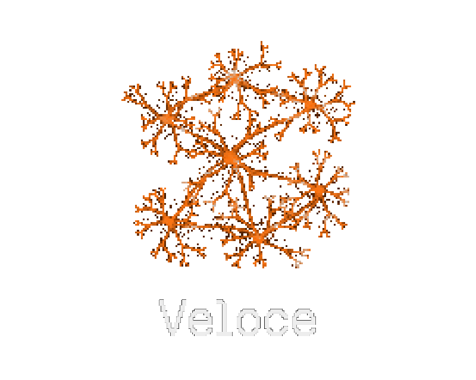

  

  <strong>A software engineering harness for craftsmen and software artisans.</strong> 
  Build software with discipline, clarity, and care.

  

  <a href="#overview">Overview</a> ·
  <a href="#architecture">Architecture</a> ·
  <a href="#how-it-works">How it works</a> ·
  <a href="LICENSE">License</a>

## Overview

Veloce is a software engineering harness designed to help people and agents build reliable software with the mindset of a craftsperson. It aims to make disciplined engineering practices part of the development loop rather than an afterthought.

The project brings together clear instructions, repeatable workflows, and practical guardrails so that planning, implementation, review, and verification remain consistent as software evolves.

Veloce is intentionally tool- and model-agnostic. The goal is not to prescribe a single way to write software, but to provide a dependable foundation that teams can adapt to their own stack and standards.

## Architecture

## How it works

## License

Veloce is available under the [MIT License](LICENSE).

  <em>In memory of the software craftsmen who laid the foundations for today's technology and agentic revolution.</em>

