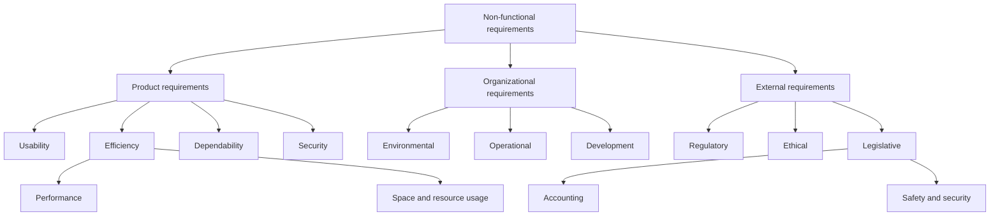

# Requirements engineering
Guidelines:
- Functional requirements:
- Non-functional requirements:

- The output of this process and skill is a REQUIREMENTS.md file listing the requirements: Each row represents a requirement alongisde a percentage metric assessing whether it's been accuratly explained. Keep asking questions to the user until the metric for all requirements is at 100%

## Elicitation
- Always assume users don't know what they want from a computer system except in the most general terms; they may find it difficult to articulate what they want the system to do; they may make unrealistic demands because they don’t know what is and isn’t feasible

- Stakeholders in a system naturally express  REQUIREMENTSirements in their own terms and
with implicit knowledge of their own work. Requirements engineers, without
experience in the customer’s domain, may not understand these requirements.
3. Different stakeholders, with diverse requirements, may express their requirements in different ways. Requirements engineers have to discover all potential
sources of requirements and discover commonalities and conflict.
4. Political factors may influence the requirements of a system. Managers may
demand specific system requirements because these will allow them to increase
their influence in the organization.
5. The economic and business environment in which the analysis takes place is
dynamic. It inevitably changes during the analysis process. The importance of
particular requirements may change. New requirements may emerge from new
stakeholders who were not originally consulted.
## Specification
the user and system requirements should
be clear, unambiguous, easy to understand, complete, and consistent.

The user requirements for a system should describe the functional and nonfunctional
requirements so that they are understandable by system users who don’t have detailed
technical knowledge. Ideally, they should specify only the external behavior of the system. The requirements document should not include details of the system architecture
or design. Consequently, if you are writing user requirements, you should not use software jargon, structured notations, or formal notations. You should write user requirements in natural language, with simple tables, forms, and intuitive diagrams

System requirements are expanded versions of the user requirements that software engineers use as the starting point for the system design. They add detail and
explain how the system should provide the user requirements.

complete and detailed specification of the whole system

should only describe the external behavior of the
system and its operational constraints.

### Natural language specification
To minimize misunderstandings when writing natural language requirements, I
recommend that you follow these simple guidelines:
1. Invent a standard format and ensure that all requirement definitions adhere to
that format. Standardizing the format makes omissions less likely and requirements
easier to check. I suggest that, wherever possible, you should write the requirement
in one or two sentences of natural language.
2. Use language consistently to distinguish between mandatory and desirable
requirements. Mandatory requirements are requirements that the system must
support and are usually written using “shall.” Desirable requirements are not
essential and are written using “should.”
3. Use text highlighting (bold, italic, or color) to pick out key parts of the requirement.
4. Do not assume that readers understand technical, software engineering language.
It is easy for words such as “architecture” and “module” to be misunderstood.
Wherever possible, you should avoid the use of jargon, abbreviations, and acronyms.
5. Whenever possible, you should try to associate a rationale with each user
requirement. The rationale should explain why the requirement has been
included and who proposed the requirement (the requirement source), so that
you know whom to consult if the requirement has to be changed. Requirements
rationale is particularly useful when requirements are changed, as it may help
decide what changes would be undesirable.

### Structured specifications
use templates to specify system requirements.

User requirements shoudl be initially written on cards, one per card. Each card should ahve a number of fields such as rationale, dependencies on other requirements, the source of the requiremen, and supportingf materials

The following info should be included
When a standard format is used for specifying functional requirements, the following information should be included:
1. A description of the function or entity being specified.
2. A description of its inputs and the origin of these inputs.
3. A description of its outputs and the destination of these outputs.
4. Information about the information needed for the computation or other entities
in the system that are required (the “requires” part).
5. A description of the action to be taken.
6. If a functional approach is used, a precondition setting out what must be true
before the function is called, and a postcondition specifying what is true after
the function is called.
7. A description of the side effects (if any) of the operation.

You can add extra informatiuon to natural language reuiqqmnrerner such as tables or graphical models of the system.

Use tables when there are a number of possible alternative
situations and you need to describe the actions to be taken for each of these.

### Use cases
a use case identifies the
actors involved in an interaction and names the type of interaction. You then add
additional information describing the interaction with the system. The additional
information may be a textual description or one or more graphical models such as
the UML sequence or state charts 

documented using a high-level use case diagram. The set of use
cases represents all of the possible interactions that will be described in the system
requirements

epresented as stick figures. Each class of interaction is represented as a named ellipse.
Lines link the actors with the interaction. Optionally, arrowheads may be added to
lines to show how the interaction is initiated.

### The software requirements document
aka SRS for software requirements specification.

official statement of what the system developers should
implement. It may include both the user requirements for a system and a detailed
specification of the system requirements. Sometimes the user and system requirements are integrated into a single description. In other cases, the user requirements
are described in an introductory chapter in the system requirements specification.

Collect user requirements incrementallyu and write these on cards or whiteboards as short user stories
Priritise these stories for imoplementaion int he next incremetn oif the system.
### Types of non-functional requirements

Use the following taxonomy to identify where a non-functional requirement
comes from and to avoid treating every quality constraint as a product
property.

- **Product requirements** constrain qualities of the delivered system, such
  as response time, memory consumption, availability, ease of use, and
  protection against unauthorized access.
- **Organizational requirements** arise from the policies, processes, and
  technical environment of the organization building or operating the
  system. Examples include mandated programming languages, deployment
  platforms, development standards, and operating procedures.
- **External requirements** come from outside the development organization.
  Examples include laws, industry regulations, interoperability obligations,
  privacy rules, safety duties, and ethical constraints.

Write each non-functional requirement as a measurable verification target.
For example, replace "the search must be fast" with "under a load of 100
concurrent users, 95% of search requests must complete within 500 ms."

> Adapted and redrawn from Ian Sommerville's non-functional requirements
> classification in *Software Engineering*. This is a conceptual summary, not
> a reproduction of the textbook figure.

## Validation
During the validation, you check that requirements define the system that the customer really wants.

During the requirements validation process, different types of checks should be
carried out on the requirements in the requirements document. These checks include:
1. Validity checks These check that the requirements reflect the real needs of system users. Because of changing circumstances, the user requirements may have
changed since they were originally elicited.
2. Consistency checks Requirements in the document should not conflict. That is,
there should not be contradictory constraints or different descriptions of the
same system function.
3. Completeness checks The requirements document should include requirements
that define all functions and the constraints intended by the system user.
4. Realism checks By using knowledge of existing technologies, the requirements
should be checked to ensure that they can be implemented within the proposed
budget for the system. These checks should also take account of the budget and
schedule for the system development.
5. Verifiability To reduce the potential for dispute between customer and contractor, system requirements should always be written so that they are verifiable.
This means that you should be able to write a set of tests that can demonstrate
that the delivered system meets each specified requirement.

- instructions: skills/requirements-engineering/references/validation.md

Validation techniques:

1. Build a mock-up of the solution in plain html, css, and javascript just to showcase and validate the vision of the system (if there is any frontend). Otherwise skip.

2. Test-case generation Requirements should be testable. If the tests for the
requirements are devised as part of the validation process, this often reveals
requirements problems.

3.Requirements reviews The requirements are analyzed systematically by the user/programme who check for errors and inconsistencies. By the end of the phase ask the user to write "sign off" which acts as a legal proof that the user validates the requirements and you can proceed further.   If a test is difficult or impossible to design, this usually
means that the requirements will be difficult to implement and should be reconsidered.

### Requirements change
Problem analysis and change specification The process starts with an identified requirements problem or, sometimes, with a specific change proposal.
During this stage, the problem or the change proposal is analyzed to check that
it is valid. This analysis is fed back to the change requestor who may respond
with a more specific requirements change proposal, or decide to withdraw
the request.
2. Change analysis and costing The effect of the proposed change is assessed
using traceability information and general knowledge of the system requirements. The cost of making the change is estimated in terms of modifications to
the requirements document and, if appropriate, to the system design and implementation. Once this analysis is completed, a decision is made as to whether or
not to proceed with the requirements change.

Change implementation The requirements document and, where necessary, the
system design and implementation, are modified. You should organize the
requirements document so that you can make changes to it without extensive
rewriting or reorganization. As with programs, changeability in documents is
achieved by minimizing external references and making the document sections
as modular as possible. Thus, individual sections can be changed and replaced
without affecting other parts of the document.

Performn the fopllowing activiities in order
Requirements discovery and understanding This is the process of interacting with
stakeholders of the system to discover their requirements. Domain requirements
from stakeholders and documentation are also discovered during this activity.
2. Requirements classification and organization This activity takes the unstructured collection of requirements, groups related requirements and organizes
them into coherent clusters.
3. Requirements prioritization and negotiation Inevitably, when multiple stakeholders are involved, requirements will conflict. This activity is concerned with
prioritizing requirements and finding and resolving requirements conflicts

write that shit down in a REQUIREMENTS.md file within /docs

You are software engineer interviewing a stakeholder (technical or non-technical) about the system to be built.

To be an effective interviewer, you should bear two things in mind:
1. You should be open-minded, avoid preconceived ideas about the requirements,
and willing to listen to stakeholders. If the stakeholder comes up with surprising
requirements, then you should be willing to change your mind about the system.
2. You should prompt the interviewee to get discussions going by using a springboard question or a requirements proposal, or by working together on a prototype system. Saying to people “tell me what you want” is unlikely to result in
useful information. They find it much easier to talk in a defined context rather
than in general terms.

### Stories and scenarios
Stories and scenarios are essentially the same thing. They are a description of how
the system can be used for some particular task. They describe what people do, what
information they use and produce, and what systems they may use in this process.
The difference is in the ways that descriptions are structured and in the level of detail
presented. Stories are written as narrative text and present a high-level description of
system use; scenarios are usually structured with specific information collected such
as inputs and outputs. I find stories to be effective in setting out the “big picture.”
Parts of stories can then be developed in more detail and represented as scenarios.

Useful template:

Title for the story or scenario
<user story>
Scenarios are descriptions of example user
interaction sessions.
A scenario starts with an outline of the interaction.

 a scenario may include:
1. A description of what the system and users expect when the scenario starts.
2. A description of the normal flow of events in the scenario.
3. A description of what can go wrong and how resulting problems can be handled.
4. Information about other activities that might be going on at the same time.
5. A description of the system state when the scenario ends.
