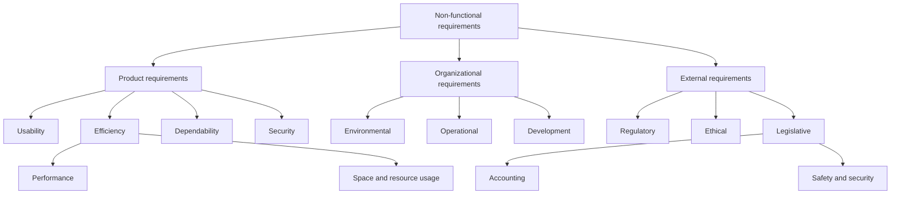

# Specification

Turn the stories in `docs/REQUIREMENTS.md` into system requirements: precise,
testable statements of what the system shall do. Elicitation already wrote the
stories, their acceptance criteria and the Out of scope lists. Don't rewrite
them; add system requirements to them.

Contents: Rules · Specification loop · Requirement formats · Additions to
REQUIREMENTS.md · Exit checklist · Reference: non-functional requirement
categories

## Rules
- **Stay in scope.** Every requirement traces to a story, a success measure, a
  stakeholder need or a decision in `docs/DECISIONS.md`. Never add a
  capability nobody asked for,
  and never specify anything that is out of scope. Put gaps and new ideas
  under Open questions instead.
- **One story at a time.** Specify stories in rank order. Finish a story,
  including its checks, before starting the next.
- **Behavior, not design.** Describe only what can be observed at the edge of
  the system: screens, messages, files and API responses. Languages,
  frameworks, database tables and class names belong in
  `docs/ARCHITECTURE.md`. The exception is technology the user or their
  organization requires; record it as an organizational non-functional
  requirement.
- **Plain language.** The user reviews these requirements during validation.
  Use the terms defined in the Glossary and avoid jargon.
- **Assume or ask.** When a detail has an obvious default that almost any user
  would accept (for example, showing times in local time), record it under
  Assumptions. When reasonable people could choose differently and the choice
  changes scope, cost, security or how people use the system, add it to Open
  questions. Assumptions only fill in details of behavior a story already
  asks for, such as the wording of a message; they never add a capability.

## Specification loop
For each story, in rank order:
1. Read the story, its acceptance criteria and its Out of scope line.
2. Write its functional requirements in EARS form. Cover every acceptance
   criterion and at least one failure case.
3. Add the non-functional requirements that apply only to this story under
   its System requirements heading. Put those that apply to several stories
   under Quality requirements.
4. Write the Verified by steps for each requirement.
5. Update the Glossary, Key entities and Assumptions.
6. If the story turns out to depend on another story, add that story to
   Depends on. If this breaks the rank order, add an Open question instead of
   re-ranking the stories yourself. If it depends on something no story
   covers, add an Open question too: the user may need a new story.
7. Check the story against the "Each story" part of the exit checklist and fix
   what fails before moving on.

When every story is done, ask the user the Open questions, record the answers,
update the affected requirements and run the whole exit checklist.

## Requirement formats

### Functional requirements
Write each one as a single sentence in one of these EARS patterns. Use "shall"
for mandatory behavior and "should" for desirable behavior.

| Pattern | Template |
|---|---|
| Always active | `The system shall <response>.` |
| Event | `When <trigger>, the system shall <response>.` |
| State | `While <state>, the system shall <response>.` |
| Optional feature | `Where <feature is included>, the system shall <response>.` |
| Failure | `If <unwanted event>, then the system shall <response>.` |
| Combined | `While <state>, when <trigger>, the system shall <response>.` |

If a sentence needs "and" to join two responses, split it into two
requirements.

### Non-functional requirements
Write each one as a measurable target and name its category (see the
reference at the end). Replace "search must be fast" with "While 100 users are
searching at the same time, the system shall complete 95% of searches within
500 ms." If the user never gave a target, write the requirement with a
proposed target and add an Open question asking the user to confirm it.

### Fields
Every requirement, functional or non-functional, uses this layout:

```markdown
- **FR-001:** When a member cancels an upcoming booking, the system shall
  make the room available to other members.
  - Traces to: S03
  - Rationale: Rooms held by cancelled bookings would otherwise sit empty.
  - Verified by:
    1. As member A, book room 1 for tomorrow at 10:00.
    2. Cancel that booking.
    3. As member B, check that room 1 shows as free tomorrow at 10:00.
```

- **ID:** `FR-001` for functional and `NFR-001` for non-functional
  requirements, numbered across the whole document. Never reuse an ID.
- **Traces to:** the story the requirement serves, plus any success measure
  or decision it comes from. Quality requirements trace to the success
  measure, stakeholder need or decision they come from.
- **Rationale:** why the requirement exists. If someone other than the
  story's source asked for it, name them.
- **Verified by:** numbered steps that a person or an end-to-end test can
  follow, ending in an observable check. For a non-functional requirement,
  say how to measure the target. When the behavior depends on the time or on
  another system, describe the check in the user's terms (for example, "at
  23:59 on the booking day" or "check member A's email inbox"); how to
  control the clock or the other system is a design decision.
- **Details:** required when the requirement stores, calculates or changes
  data, or exchanges it with another system; leave it out otherwise. List the inputs and where they
  come from, the outputs and where they go, what must be true before, what is
  true after, and any side effects.

### Other notations
- For a rule with three or more cases, such as prices that depend on
  membership and time of day, use a decision table.
- For a flow with three or more actors (people or other systems, not counting
  this one) or three or more states, add a Mermaid sequence or state diagram
  next to the requirements it explains.
- Don't use pseudo-code or formal mathematical notation. The user can't
  review it.

## Additions to REQUIREMENTS.md
Add these sections between Out of scope and Stories:

```markdown
## Glossary
| Term | Meaning |
|---|---|
| <domain term> | <one-sentence definition> |

## Assumptions
- A-01: <what you assumed> (affects S01)

## Key entities
- **<Entity>:** <what it represents>. Key attributes: <…>. Related to: <…>.

## Quality requirements
- **NFR-001 (<category>):** <measurable target>
  - Traces to: <success measure, stakeholder need or decision>
  - Applies to: <all stories, or story IDs>
  - Rationale: <why>
  - Verified by: <how to measure>
```

Quality requirements use the same layout as other requirements, plus an
Applies to line. At the end of each story section, add a
`#### System requirements` heading followed by that story's requirements.

Together with its row in the Stories table, a finished story section holds
everything one feature-list entry needs (for example in `feature_list.json`):
the title, the rank as priority, the story sentence as the user-visible
behavior, and the Verified by steps as the verification.

Architecture goes in `docs/ARCHITECTURE.md` and decisions in
`docs/DECISIONS.md`. Git keeps the version history.

## Exit checklist
Specification is finished when every box is checked.

Each story:
- [ ] It has at least one functional requirement.
- [ ] Each of its acceptance criteria is covered by at least one requirement.
- [ ] It has at least one failure requirement (`If …, then …`).
- [ ] Each of its requirements has an ID, Traces to, Rationale and Verified
      by, plus Details where required.
- [ ] None of its requirements adds something nobody asked for or contradicts
      Out of scope.
- [ ] Each requirement is one sentence with one "shall" or "should".
- [ ] No requirement uses vague words. Review every hit of
      `grep -n -i -w -E "fast|quick|quickly|easy|easily|simple|simply|user-friendly|intuitive|robust|flexible|efficient|seamless|appropriate|etc|and/or|TBD|TODO" docs/REQUIREMENTS.md`.
      Hits outside requirements, such as the user's own words in a story,
      can stay.
- [ ] No requirement contains implementation details (languages, frameworks,
      tables or class names), except technology the user requires, recorded
      as an organizational requirement.

Whole document:
- [ ] Every domain term (a word with a specific meaning in the user's world,
      such as "no-show") is in the Glossary and used the same way throughout.
- [ ] Open questions is empty.

Then continue with the Validation section of SKILL.md.

## Reference: non-functional requirement categories
Use these categories to find non-functional requirements and to label each
one. Not every quality constraint is a property of the product itself.



- **Product requirements** constrain qualities of the delivered system, such
  as response time, memory consumption, availability, ease of use, and
  protection against unauthorized access.
- **Organizational requirements** arise from the policies, processes, and
  technical environment of the organization building or operating the
  system. Examples include mandated programming languages, deployment
  platforms, development standards, and operating procedures.
- **External requirements** come from outside the development organization.
  Examples include laws, industry regulations, interoperability obligations,
  privacy rules, safety duties, and ethical constraints.

> Sources: the split between user and system requirements, the Details
> fields and the categories above are adapted from Ian
> Sommerville's *Software Engineering*. The diagram is redrawn and the text
> paraphrased, not reproduced. EARS patterns: Alistair Mavin et al. (2009),
> <https://alistairmavin.com/ears/>.
