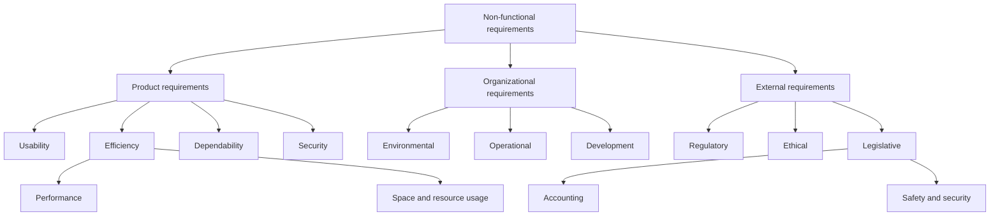

## Specification
the user and system requirements should
be clear, unambiguous, easy to understand, complete, and consistent.

The user requirements for a system should describe the functional and nonfunctional
requirements so that they are understandable by system users who don’t have detailed
technical knowledge. Ideally, they should specify only the external behavior of the
system. The requirements document should not include details of the system architecture
or design. Consequently, if you are writing user requirements, you should not use software jargon, structured notations, or formal notations. You should write user requirements in natural language, with simple tables, forms, and intuitive diagrams

System requirements are expanded versions of the user requirements that software engineers use as the starting point for the system design. They add detail and
explain how the system should provide the user requirements.

complete and detailed specification of the whole system

should only describe the external behavior of the
system and its operational constraints.

### Natural language specification
To minimize misunderstandings when writing natural language requirements, I
recommend that you follow these simple guidelines:
1. Invent a standard format and ensure that all requirement definitions adhere to
that format. Standardizing the format makes omissions less likely and requirements
easier to check. I suggest that, wherever possible, you should write the requirement
in one or two sentences of natural language.
2. Use language consistently to distinguish between mandatory and desirable
requirements. Mandatory requirements are requirements that the system must
support and are usually written using “shall.” Desirable requirements are not
essential and are written using “should.”
3. Use text highlighting (bold, italic, or color) to pick out key parts of the requirement.
4. Do not assume that readers understand technical, software engineering language.
It is easy for words such as “architecture” and “module” to be misunderstood.
Wherever possible, you should avoid the use of jargon, abbreviations, and acronyms.
5. Whenever possible, you should try to associate a rationale with each user
requirement. The rationale should explain why the requirement has been
included and who proposed the requirement (the requirement source), so that
you know whom to consult if the requirement has to be changed. Requirements
rationale is particularly useful when requirements are changed, as it may help
decide what changes would be undesirable.

### Structured specifications
use templates to specify system requirements.

User requirements shoudl be initially written on cards, one per card. Each card should ahve a number of fields such as rationale, dependencies on other requirements, the source of the requiremen, and supportingf materials

The following info should be included
When a standard format is used for specifying functional requirements, the following information should be included:
1. A description of the function or entity being specified.
2. A description of its inputs and the origin of these inputs.
3. A description of its outputs and the destination of these outputs.
4. Information about the information needed for the computation or other entities
in the system that are required (the “requires” part).
5. A description of the action to be taken.
6. If a functional approach is used, a precondition setting out what must be true
before the function is called, and a postcondition specifying what is true after
the function is called.
7. A description of the side effects (if any) of the operation.

You can add extra informatiuon to natural language reuiqqmnrerner such as tables or graphical models of the system.

Use tables when there are a number of possible alternative
situations and you need to describe the actions to be taken for each of these.

### Use cases
a use case identifies the
actors involved in an interaction and names the type of interaction. You then add
additional information describing the interaction with the system. The additional
information may be a textual description or one or more graphical models such as
the UML sequence or state charts

documented using a high-level use case diagram. The set of use
cases represents all of the possible interactions that will be described in the system
requirements

epresented as stick figures. Each class of interaction is represented as a named ellipse.
Lines link the actors with the interaction. Optionally, arrowheads may be added to
lines to show how the interaction is initiated.

### Types of non-functional requirements

Use the following taxonomy to identify where a non-functional requirement
comes from and to avoid treating every quality constraint as a product
property.

- **Product requirements** constrain qualities of the delivered system, such
  as response time, memory consumption, availability, ease of use, and
  protection against unauthorized access.
- **Organizational requirements** arise from the policies, processes, and
  technical environment of the organization building or operating the
  system. Examples include mandated programming languages, deployment
  platforms, development standards, and operating procedures.
- **External requirements** come from outside the development organization.
  Examples include laws, industry regulations, interoperability obligations,
  privacy rules, safety duties, and ethical constraints.

Write each non-functional requirement as a measurable verification target.
For example, replace "the search must be fast" with "under a load of 100
concurrent users, 95% of search requests must complete within 500 ms."

> Adapted and redrawn from Ian Sommerville's non-functional requirements
> classification in *Software Engineering*. This is a conceptual summary, not
> a reproduction of the textbook figure.

## Notations for writing system requirements

| Notation | Description |
|---|---|
| Natural language sentences | Requirements are written as numbered natural-language sentences, with each sentence expressing exactly one requirement. |
| Structured natural language | Requirements are written in natural language using a standard form or template; each field captures one aspect of the requirement. |
| Design description languages | A programming-language-like notation with more abstract features describes an operational model of the system. Rarely used today, but can help for interface specifications. |
| Graphical notations | Graphical models (commonly UML use case and sequence diagrams), supplemented by text annotations, define the functional requirements. |
| Mathematical specifications | Notations based on mathematical concepts such as finite-state machines or sets. They remove ambiguity, but most customers cannot read them, so they struggle to confirm the specification reflects the needs or accept the specification as a contract. |

## The structure of a requirements document

| Chapter | Description |
|---|---|
| Preface | Defines the intended readership, the version history, the rationale for each new version, and a summary of changes between versions. |
| Introduction | Explains why the system is needed, briefly describes its functions and how it interacts with other systems, and shows how it fits the overall business or strategic objectives of the organization commissioning it. |
| Glossary | Defines the technical terms used in the document, without assuming any particular expertise or experience from the reader. |
| User requirements definition | Describes the services provided to users and the non-functional system requirements, using natural language, diagrams, or other notations customers can understand. Also specifies any product and process standards to be followed. |
| System architecture | Gives a high-level overview of the anticipated architecture and how functions are distributed across system modules, highlighting reused architectural components. |
| System requirements specification | Describes the functional and non-functional requirements in more detail, including interfaces to other systems where needed. |
| System models | Contains graphical models showing relationships between system components and between the system and its environment (e.g., object, data-flow, or semantic data models). |
| System evolution | Describes the fundamental assumptions the system is based on and anticipated changes due to hardware evolution, changing user needs, and so on. Useful for designers to avoid decisions that would constrain likely future changes. |
| Appendices | Provides detailed, specific supporting information, such as hardware descriptions (e.g., minimal and optimal configurations) and database descriptions (logical organization of the data and its relationships). |
| Index | Includes a normal alphabetic index, and optionally indexes of diagrams, functions, and so on. |

> Adapted from Ian Sommerville's *Software Engineering* tables "Notations for
> writing system requirements" and "The structure of a requirements document".
> The descriptions are paraphrased summaries, not verbatim reproductions.
